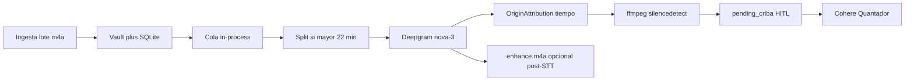
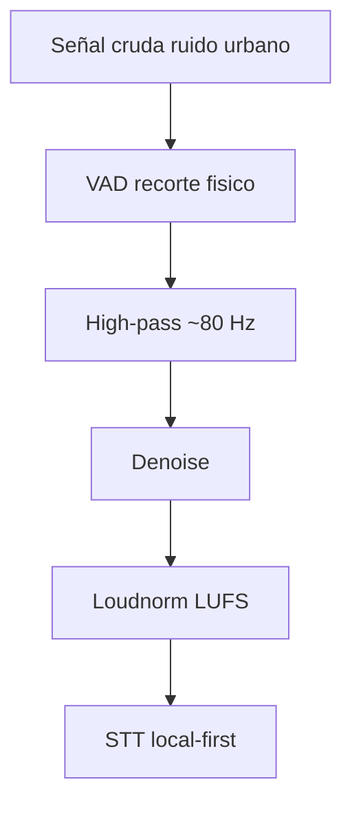
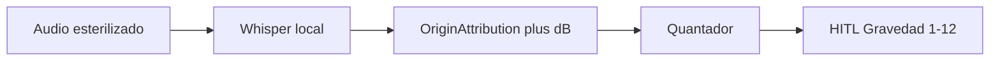

# Acoustic Guardian — audio en Deprocast

```text
documento   : audio.md
producto    : Deprocast 0.7.1 → arquitectura auditiva
qué es      : Cuerpo sensorial (STT) · esterilización pre-semántica
ancla       : pipeline.ts · audioAnalysis.ts · deepgram.ts · liveWs.ts
fecha       : 2026-09-02
```

El organismo asume que el audio es un **cuerpo estático**: entra entero, espera en cola, se transcribe en la nube, se “purifica” en la Mente (LLM) y recién entonces el operador aplica Alma (HITL) en criba / validar. Eso es falso para grabaciones de caminata: ruido urbano, huecos de semáforo, ráfagas de viento.

**Acoustic Guardian** es el nombre de la arquitectura futura: dejar de ser un batch processor rígido en la nube y convertirse en un *pipeline* físico de purificación **local en cascada**, antes de extraer el primer Quántomo.

Este archivo documenta el **as-is real** (no hay `docs/Audio.md` ni `lib/gcp-speech-processor.ts` en este repo), los huecos frente a ese diseño, y el mapa de cambios. No implementa Silero, Whisper ni sockets VAD.

Corrección de linaje: en 0.7.1 el motor STT **no es GCP Speech**. Es **Deepgram** (`nova-3`, `es`), con stub si falta `DEEPGRAM_API_KEY` o falla la llamada. El mismo patrón se reutiliza en Trinchera, cuaderno, bookmarks e Instagram.

---

## 1. Tesis

Deepgram / Whisper alucinan en silencio puro (“gracias por ver el vídeo”). El viento y el motor de un autobús inyectan energía por debajo de ~100 Hz y saturan el rango dinámico. Un archivo de 40 minutos con pausas no debería viajar entero a un STT: primero hay que **cortar, filtrar y normalizar ondas**.

La capa semántica (Quantador, NER, Gravedad 1–12) solo recibe texto si el archivo ya está esterilizado.

---

## 2. As-is 0.7.1 (batch cloud-first)



Flujo operativo (Trinchera):

```text
INPUT (audio) → VAULT + SQLite → PIPELINE (STT → LLM) → ADUANA (HITL) → VALIDADA
```

Estación 1 en [`server/services/pipeline.ts`](server/services/pipeline.ts) (`transcribeForCriba`):

1. Split si duración > 22 min ([`server/services/audioSplit.ts`](server/services/audioSplit.ts), `AUDIO_SEGMENT_MAX_SEC`).
2. `transcribeAudio` en [`server/services/deepgram.ts`](server/services/deepgram.ts) sobre el archivo **crudo** (ADTS/mp4/mp3/ogg; chunks si > ~55 s).
3. `resolveOriginAttribution` ([`server/services/originAttribution.ts`](server/services/originAttribution.ts)): fecha desde filename o transcript. **No** hay densidad acústica ni dB de fondo.
4. `analyzeAudioSilence` **después** del STT: metadatos para el player, no recorte físico.
5. Persist: `status = pending_criba`, `diarization_json`, `audio_analysis_json`.
6. Si `AUDIO_ENHANCE_ON_INGEST=1`, `enhanceAudio` escribe `enhanced.m4a` **después** del STT (reproducción, no entrada al modelo).

La cola es in-process, single-flight (`POST /api/pipeline/run`, `GET /api/pipeline/status`).

### 2.1 Live ya existe (no es Guardian)

Canal “Directo”: mic → PCM linear16 → proxy [`server/liveWs.ts`](server/liveWs.ts) → Deepgram Live ([`src/live/deepgramLive.ts`](src/live/deepgramLive.ts)). Endpointing en la nube (~300 ms). **No** hay VAD local: se envía el stream completo. La API key no sale del server.

Cofre (extensión Chrome) reutiliza el mismo proxy; entries de captura pueden entrar a `pending_criba` sin el STT batch.

### 2.2 ffmpeg que ya está cableado

[`server/services/audioAnalysis.ts`](server/services/audioAnalysis.ts):

| Pieza | Env / constante | Qué hace hoy | Qué no hace |
|-------|-----------------|--------------|-------------|
| `silencedetect` | `AUDIO_SILENCE_NOISE_DB` (−35), `AUDIO_SILENCE_MIN_SEC` (3) | Regiones de silencio + `speech_regions` (también huecos entre utterances Deepgram) | No corta el archivo; sirve a skip en criba ([`src/hooks/useSmartAudioPlayback.ts`](src/hooks/useSmartAudioPlayback.ts)) |
| `ENHANCE_FILTER` | `AUDIO_ENHANCE_ON_INGEST` (default `0`) | `highpass=f=80`, `afftdn=nf=-25`, `acompressor`, `loudnorm=I=-16:TP=-1.5` → AAC 128k | Corre **post-STT**; loudnorm a **−16 LUFS**, no −14 |

Aduana de audio: [`src/components/AudioCribaPanel.tsx`](src/components/AudioCribaPanel.tsx). Tras voto de peso, fase B: extract Cohere (quántomos / acciones / entidades).

Otros consumidores Deepgram: [`server/services/notebookSources.ts`](server/services/notebookSources.ts), [`server/services/bookmarkProcess.ts`](server/services/bookmarkProcess.ts), Instagram (bandas 7–9).

---

## 3. Gap: batch rígido vs caminata

| Supuesto 0.7.1 | Realidad de caminata |
|----------------|----------------------|
| El archivo es voz densa | Minutos de vacío; el STT rellena con basura |
| El micrófono es de estudio | Viento y rumble &lt; 100 Hz ensucian todo el espectro |
| Volumen estable | Susurros vs gritos; el modelo falla en ambos extremos |
| Un canal de ingesta (carpeta / upload) | Mic en vivo **y** lotes DJI/celular |
| Purificar en el LLM | Demasiado tarde: el daño es de onda, no de lexema |
| HITL sobre un bloque enorme de transcript | Deberían ser partículas ya cortadas |

Lo reutilizable: filtro 80 Hz, denoise FFT, loudnorm, regiones de habla, split, diarización Deepgram, criba con skip de silencios. Lo que falta es **ordenar** esa física **antes** del STT y añadir VAD que recorte el archivo.

---

## 4. Objetivo: ingesta híbrida

El sistema deja de ser una sola carpeta de subida.

### 4.1 Canal Live — Acoustic Guardian

Socket continuo que monitoriza el micrófono. No graba todo: umbral de activación (VAD local). Solo los utterances que superan energía en bandas vocales (aprox. 85 Hz–8 kHz) salen hacia esterilización + STT.

Hoy Directo es el esqueleto de transporte; el Guardian sustituye “stream siempre a Deepgram” por “gate local, luego transcribir”.

### 4.2 Canal Búnker — lotes de caminata

Ingesta masiva de `.m4a` / `.wav` (ideal 32-bit float) desde DJI Mic o celular. Misma cascada física que Live, en batch: vault → esterilizar → STT → criba.

---

## 5. Capa física: esterilización pre-semántica

Antes de que cualquier texto llegue al Quantador, el audio se purifica en local (Node + ffmpeg; ONNX ligero más adelante).



Comportamiento de bloques (equivalente al simulador conceptual VAD / HPF / denoise / STT; no hay widget Canvas en el repo):

- Señal inicial: amplitud alta y “sucia” según ruido de fondo.
- VAD on: desaparecen los tramos planos (silencio); el archivo se densifica.
- High-pass on: se van las ondas gruesas de baja frecuencia (rumble / viento).
- Denoise on: se suavizan los bordes dentados.
- Medidor de precisión de transcripción: sube cuando más bloques limpian una señal ruidosa.

### 5.1 VAD en cero (Silero u equivalente)

**Problema.** Huecos de semáforo y pasos sin habla. El STT alucina.

**Solución.** Modelo ligero (p. ej. Silero VAD) mide energía en bandas vocales. Si no supera umbral durante un utterance, **se corta el archivo**. 40 min con pausas → ~12 min de voz densa (`sterile.m4a` o concat de `speech_regions`).

Puente F1 (sin ONNX): usar las `speech_regions` de ffmpeg `silencedetect` para concat **antes** del STT. Es umbral de energía, no clasificador de voz; peor que Silero pero ya está en código.

### 5.2 Filtrado frecuencial

**Problema.** Viento / bus: energía masiva &lt; 100 Hz.

**Solución.** High-pass abrupto ~80 Hz. Ya está en `ENHANCE_FILTER`. Hay que **promoverlo antes del STT**, no solo para el player.

Low-pass opcional más adelante (techo ~8 kHz) si hace falta para VAD o bitrate.

### 5.3 Normalización dinámica

Amplitud constante hacia el STT. Diseño objetivo: **−14 LUFS**. Hoy `loudnorm=I=-16`. Documentar el delta al promover el filtro: o se cambia a −14 o se deja −16 con justificación (headroom / coincidencia con broadcast).

---

## 6. Capa de traducción: STT local-first

El archivo esterilizado entra a **Whisper** local (`whisper.cpp` o WhisperX) en la VRAM del servidor de inferencia. Con silencios recortados y rumble filtrado, menos alucinaciones y menos tiempo de cómputo.

Deepgram permanece como:

- fallback si no hay VRAM / binario Whisper;
- Live / Cofre hasta F4 (VAD local en el socket).

Soberanía: la caminata no debería depender de una API para el camino feliz.

---

## 7. Capa semántica: origen, fragmentación, Aduana

Texto limpio → el flujo que ya existe (Cohere / Llama), con metadatos del entorno físico.

1. **Linaje ambiental (`OriginAttribution`)** — además de fecha: densidad de energía original (p. ej. “grabado a 85 dB de ruido de fondo, posible caminata urbana”). Schema a extender junto a `audio_analysis_json` / columnas nuevas; hoy el origen es solo temporal.
2. **Fragmentación molecular (Quantador)** — quántomos independientes sobre transcript denso.
3. **Extracción multi-vectorial** — acciones → `/pendientes`; entidades NER → personas/lugares; conceptos.
4. **Aduana HITL** — partículas aisladas, no un bloque monstruo; Gravedad 1–12; coagulación en el grafo.

Criba de audio (hablar vs callar, speakers, tags) sigue siendo estación previa al extract cuando el origen es lote; el Guardian no la elimina: le entrega menos basura.



---

## 8. Mapa de cambios (código)

| Superficie | As-is | To-be |
|------------|-------|--------|
| [`server/services/pipeline.ts`](server/services/pipeline.ts) | STT sobre vault crudo; analysis y enhance después | Esterilizar (VAD + HPF + denoise + loudnorm) → STT sobre `sterile` / `enhanced`; analysis de energía **antes** o en paralelo para linaje |
| [`server/services/audioAnalysis.ts`](server/services/audioAnalysis.ts) | `silencedetect` + enhance post-hoc | Misma cascada ffmpeg **pre-STT**; concat de `speech_regions`; más tarde Silero; loudnorm −14 vs −16 |
| [`server/services/deepgram.ts`](server/services/deepgram.ts) | Único STT batch | Fallback / live; interfaz común `transcribeAudio` con backend Whisper |
| [`server/liveWs.ts`](server/liveWs.ts) + [`src/live/deepgramLive.ts`](src/live/deepgramLive.ts) | PCM continuo a Deepgram | Gate VAD en cliente o server; no enviar silencio |
| [`server/services/originAttribution.ts`](server/services/originAttribution.ts) | Timestamp | + `noise_floor_db`, `hypothesis` (caminata urbana, interior, etc.) |
| `entries.audio_analysis_json` | silence/speech para player | + linaje, path `sterile.m4a`, flags de filtros aplicados |
| Criba / Directo / Cofre / cuaderno / bookmarks | Deepgram directo | No romper: mismo contrato de transcript + utterances; cambiar el *backend* detrás |

---

## 9. Fases (roadmap, no implementado aquí)

| Fase | Qué | Notas |
|------|-----|--------|
| **F0** | Este documento | Cerrado al existir `audio.md`. |
| **F1** | `enhanceAudio` **antes** de Deepgram; opcional concat ffmpeg de `speech_regions` → `sterile.m4a` | Implementado 2026-09-04 (`AUDIO_STERILE_BEFORE_STT`, LUFS −16). Concat opt-in. |
| **F2** | Silero VAD ONNX + metadatos de energía en origen | Recorte más fiel que `silencedetect`. |
| **F3** | Whisper local-first (`whisper.cpp` / WhisperX) | Deepgram fallback. |
| **F4** | Live con VAD local; Deepgram Live como respaldo | Guardian de verdad en el socket. |

---

## 10. Riesgos

- **Voz baja / lejos del mic.** VAD o `silencedetect` agresivo recorta susurros. Umbrales configurables (`AUDIO_SILENCE_*` ya lo son; Silero igual).
- **Windows.** ffmpeg por `whichFfmpeg`; PATH de Node local del operador. Sin ffmpeg no hay cascada física.
- **VRAM.** WhisperX/cpp fallan en máquinas sin GPU; el fallback Deepgram debe seguir siendo de un interruptor.
- **Contratos.** Criba espera `diarization_json` / utterances. Whisper no diariza igual que Deepgram; F3 debe mapear segmentos o degradar speakers a un canal.
- **No romper Directo/Cofre** en F1–F3: el proxy live puede seguir cloud hasta F4.
- **Alucinaciones residuales.** Esterilizar reduce, no elimina. HITL sigue siendo la Aduana.

---

## 11. Relación con el resto del organismo

- Léxico Cuerpo / Mente / Alma: [`v0.7.1.md`](v0.7.1.md), [`IDA.md`](IDA.md) (poder Escriba = STT).
- Tras Aduana, embeddings: [`vector.md`](vector.md) — Mnemosyne no corre sobre transcript crudo de criba.
- Quántomos: [`quantomos.md`](quantomos.md).

El Guardian no sustituye al Quantador ni a la Aduana: les deja de mandar viento y silencio disfrazados de palabras.
